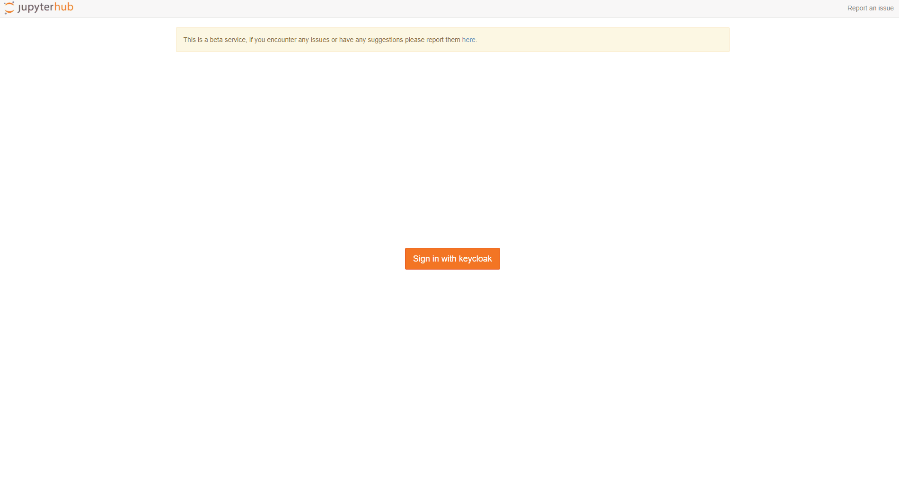

# Nimbus Cluster

This repository contains the getting started documentation for the LLNL Nimbus Cluster.

**If you run into any issues please report them [here](https://github.com/esgf-compute/getting_started/issues/new).**

## GitHub Account

If you do not already have a GitHub account please create one [here](https://github.com/join).

## Steps to login
Follow the steps below to login to the LLNL ESGF JupyterHub service hosted on the Nimbus cluster.

### Log into JupyterHub
After first login you will need to wait for authorization from an admin.

## Issues

Any issues or requests should be opened as a [github issue](https://github.com/esgf-nimbus/getting_started/issues/new).
