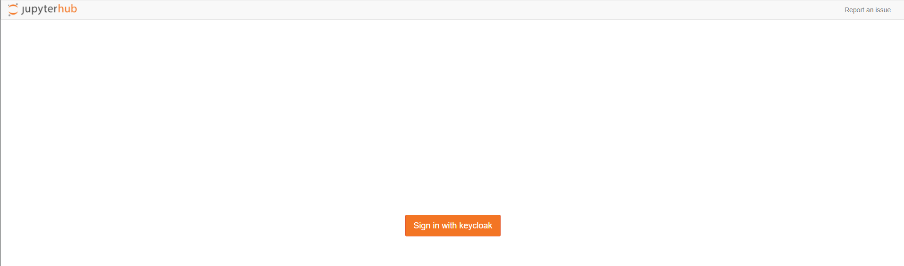
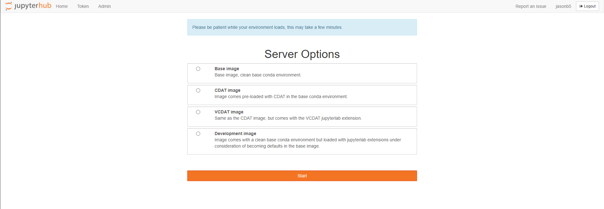
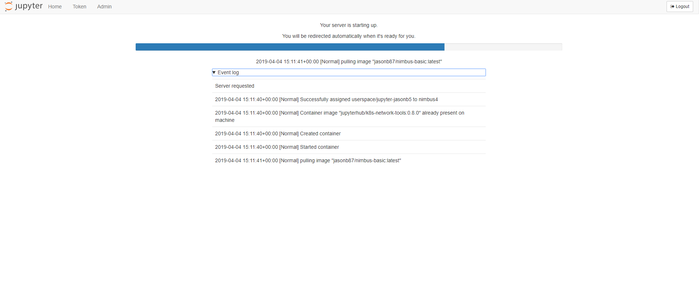
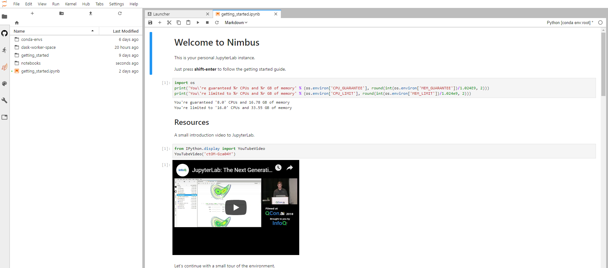

# Nimbus

This repository contains the getting started documentation for the LLNL Nimbus Cluster.

* [Create a Github account](#github-account)
* [Request Access](#request-access)
* [Next Steps](#next-steps)
* [Issues](#issues)

## GitHub Account

If you do not already have a GitHub account please create one [here](https://github.com/join)

## Request Access

**TBD**

## Next Steps

### Set Github organization membership visbility
Once you've been added to the [esgf-nimbus](https://github.com/esgf-nimbus) organization you'll need to set the visbility of organization member to public. See this [guide](https://help.github.com/en/github/setting-up-and-managing-your-github-user-account/publicizing-or-hiding-organization-membership) for a step-by-step walkthrough. 

### Log into JupyterHub on aims2
Open your browser and naviate to [aims2](https://aims2.llnl.gov/jupyterhub/). Click the "Sign in with Github" button and login with the same GitHub credentials.

### Select the environment to launch
After a successful authentication you'll be presented with a list of environment options. Once you've choosen your environment click the "Spawn" button. 

**NOTE** This may a take a few minutes to prepare your environemnt.

After clicking the "Spawn" button your environment will be dynamically provisioned in the cluster along with some persistent storage.

### View the getting started notebook
Once you're environment has spawned you'll be presented with a getting started guide that will walk you through the what's available.

## Issues

Any issues or requests should be opened as a [github issue](https://github.com/esgf-nimbus/getting_started/issues/new).
