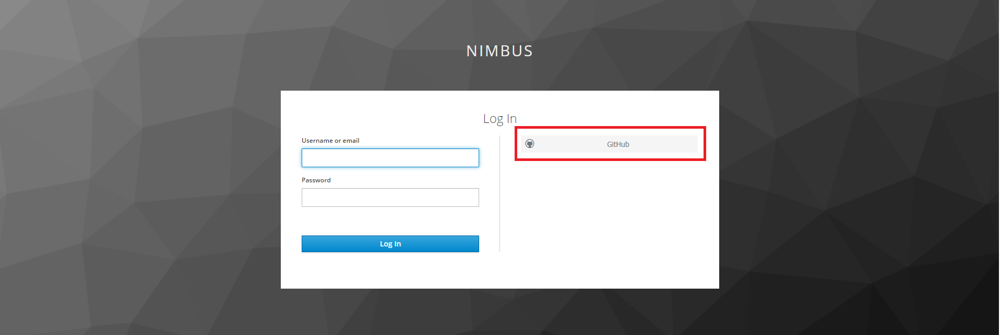
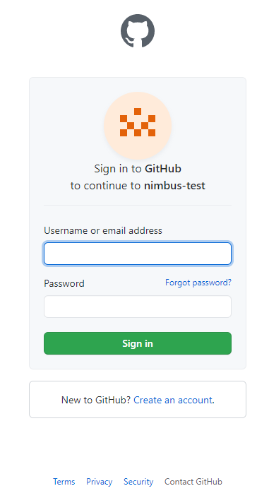
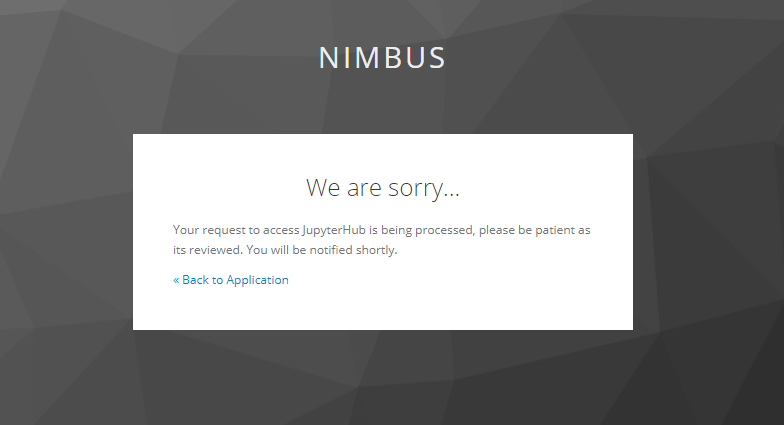

# Nimbus Cluster

This repository contains the getting started documentation for the LLNL Nimbus Cluster.

**If you run into any issues please report them [here](https://github.com/esgf-compute/getting_started/issues/new).**

## GitHub Account

If you do not already have a GitHub account please create one [here](https://github.com/join).

## Steps to login
Follow the steps below to login to the LLNL ESGF JupyterHub service hosted on the Nimbus cluster.

### Log into JupyterHub
Open your browser and naviate to [nimbus1](https://nimbus1.llnl.gov/jupyterhub/). Click the "Sign in with Keycloak" button and you'll be redirect to authenticate with the Nimbus Keycloak server.

### Choose your IDP (IDentity Provider)
Once you've landed on the Keycloak page choose your preferred identity provider. Currently we support the following:

- Github

### Sign in with your IDP
This may change depending on your chosen IDP. The following example is for GitHub. You'll be asked to login and authorize the `nimbus-test` application.

### Authorization
After logging into your IDP you'll need t wait for authorization from an admin.

### Select the environment to launch
Once you've been approved you can launch a JupyterLab image. You'll have a list of images to choose from, each image will come pre-loaded with specific JupyterLab extensions or software.

**NOTE** This may a take a few minutes to prepare your environemnt.

After clicking the "Spawn" button your environment will be dynamically provisioned in the cluster along with some persistent storage.

### View the getting started notebook
Once you're environment has spawned you'll be presented with a getting started guide that will walk you through the what's available.

## Issues

Any issues or requests should be opened as a [github issue](https://github.com/esgf-nimbus/getting_started/issues/new).
